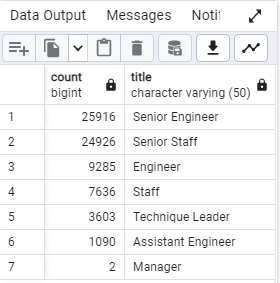
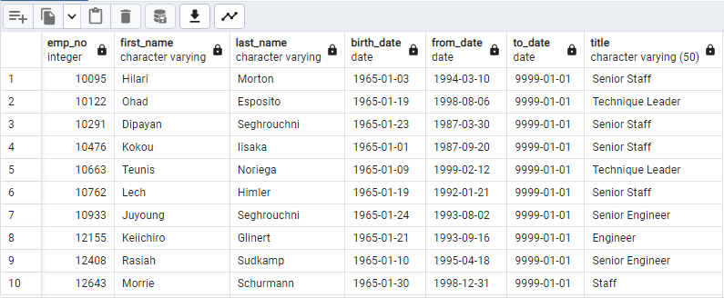

# Pewlett-Hackard-Analysis

## Overview of Analysis
We have been tasked with determining the amount of employees that will be retiring in the near future. Following that we are to determine the eligibility of employees, who aren't retiring, for participating in a mentorship for training the new employees that Pewlett-Hackard will have to hire to replace those soon-to-be retirees.

## Results
The results we have obtained are shocking to say the least. The number of employees getting ready to retire is nearly 72,500. Parsing our data to find unique titles for employees gave us that number just for employees born between 1952 and 1955. This does not consider the possibility of early retirement for managers or employees that have made the most of their retirement contributions.

When observing this data we can clearly see that retirement will hit the senior staff significantly harder than our mid level staff, and naturally much harder than our assistant staff. The most interesting comparison is the lack of Management and Leaders that are preparing for retirement. This could be due to two things: first, management may be significantly younger than our senior employees. Or secondly, and a more interesting theory, it could be that management retires earlier than the standard 65-70 age threshold. Which would make the silver wave even more dangerous if that is the case.

When we consider employees that are prepared to enter the mentorship program offered by Pewlett-Hackard to help with the training of new employees we find a much smaller number than the number retiring. A total of 1550 employees are born in 1965 and are ready to help with onboarding.

The difference between possible mentors and retirees sits at 71,000 employees, or a ratio of nearly 47:1. Significantly more employees are preparing to retire than those who are ready to help with the onboarding process.

## Summary
Pewlett-Hackard (PH) finds itself as an impasse. The silver wave is going to do significant damage to the day-to-day operations of the company. With the slim parameters of the mentorship program they cannot possible combat the ongoing retirees with new hires. If this is a set path there is only one guarantee for the company's future: it will have to shrink or risk offering a subpar product.

There are however other ways to combat this problem. I would suggest expanding the parameters of the mentorship program substantially. Instead of considering an employees age as the main factor in the decision, instead PH should consider the amount of time an employee has been with the company. Or, use age and employment time. Or, simply allow more than a single year of mentorship eligibility if the company is married to the idea of judging that eligibility simply based on age. Secondly, PH could offer incentives to keep employees on for longer as they address the hiring issue. There are ways around this issue, and now that we have this data the company can attack the problem with heightened insight and have a higher chance of avoiding negative outcomes.
